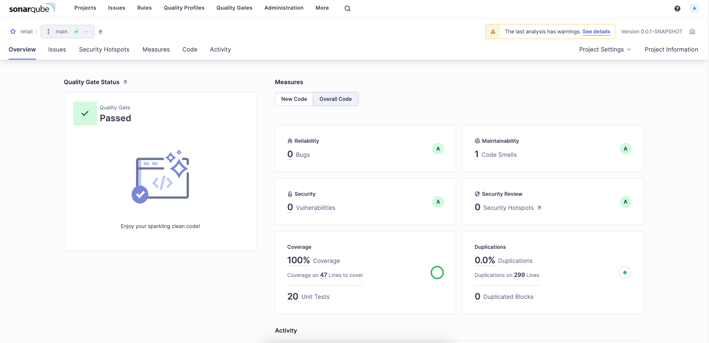

# Bill discount calculator for retail store

### Description
this program calculates different types of discounts applied on a bill depending on user types and bill amount

### How to run
- go to the main directory of the project and run `docker compose up -d` to run the services for 
  - Mongo DB
  - SonarQube
- for the sake of simplicity this project has one API endpoint to calculate a pre-existing bill with some products that is fetched from database
- after running the application, it will be listening on port 8080, you can test the api with the following URL `http://localhost:8080/api/bills/1/net-payable-amount`
- endpoints are secured with basic authentication with user `admin` and password `admin@123`

### Project configurations
- the project is designed to accept configurable values for bill discount calculation process
- you can change the percentage-based calculation and the fixed bill amount discount amount too by using following properties

``` properties
#percentage discount config
bill.discounts.percentage.employee=30
bill.discounts.percentage.affiliate=10
bill.discounts.percentage.loyalCustomer=5
bill.discounts.percentage.customerLoyaltyPeriodInYears=2
bill.discounts.percentage.discountExcludedProducts=GROCERY
#fixed discount config
bill.discounts.fixed.moneyAmount=100.00
bill.discounts.fixed.discountPerFixedMoneyAmount=5.00
```

### Run Tests and code analysis
- to run test and send code analysis report and test coverage to sonarqube server run the following command
`mvn clean verify sonar:sonar -Dsonar.token={token}`
- you can get the token from the dashboard after login to sonarqube dashboard on `http://localhost:9000` with default credentials as `admin:admin` , then go to `myAccount -> security -> generate tokens` to generate a token to use from maven to send reports
- after running tests and sending report data, you can go to sonarqube dashboard to check project metrics there 



